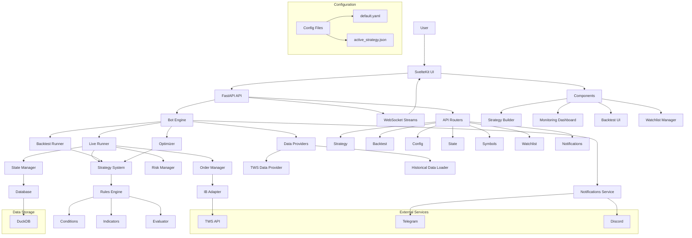

# Project Architecture

This document provides a high-level overview of the TWS Trader Bot project's architectural structure using Mermaid.js.

```mermaid
graph TD
    A[User] --> B[SvelteKit UI]
    B --> C[FastAPI API]
    C --> D[Bot Engine]
    C --> E[WebSocket Streams]
    E --> B

    D --> F[Live Runner]
    D --> G[Backtest Runner]
    D --> H[Optimizer]

    F --> I[Strategy System]
    G --> I
    H --> I

    I --> J[Rules Engine]
    J --> K[Conditions]
    J --> L[Indicators]
    J --> M[Evaluator]

    F --> N[Order Manager]
    F --> O[Risk Manager]
    F --> P[State Manager]

    N --> Q[IB Adapter]
    Q --> R[TWS API]

    P --> S[Database]
    S --> T[DuckDB]

    D --> V[Data Providers]
    V --> W[TWS Data Provider]
    V --> X[Historical Data Loader]

    C --> Y[API Routers]
    Y --> Z[Strategy]
    Y --> AA[Backtest]
    Y --> BB[Config]
    Y --> CC[State]
    Y --> DD[Symbols]
    Y --> EE[Watchlist]
    Y --> FF[Notifications]

    B --> GG[Components]
    GG --> HH[Strategy Builder]
    GG --> II[Monitoring Dashboard]
    GG --> JJ[Backtest UI]
    GG --> KK[Watchlist Manager]

    D --> LL[Notifications Service]
    LL --> MM[Telegram]
    LL --> NN[Discord]

    subgraph "External Services"
        R
        MM
        NN
    end

    subgraph "Data Storage"
        T
    end

    subgraph "Configuration"
        OO[Config Files]
        OO --> PP[default.yaml]
        OO --> QQ[active_strategy.json]
    end
```