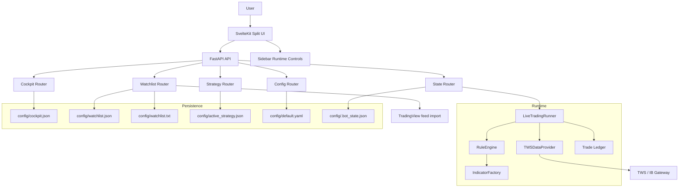

# Project Architecture

This document reflects the current local TWS trading architecture.

## Notes

- The cockpit enforces one active strategy slot per workspace.
- The live runner resolves watchlist instruments into `SYMBOL.VENUE` identifiers and reloads ticker/strategy enablement at cycle boundaries.
- The runtime now fetches per-symbol and per-timeframe market-data bundles for rule evaluation.
- The runtime requests market data for the full watchlist feed universe and only executes orders for currently enabled strategy and ticker targets.
- The direct `ibapi` TWS path is the only live execution path in this branch.